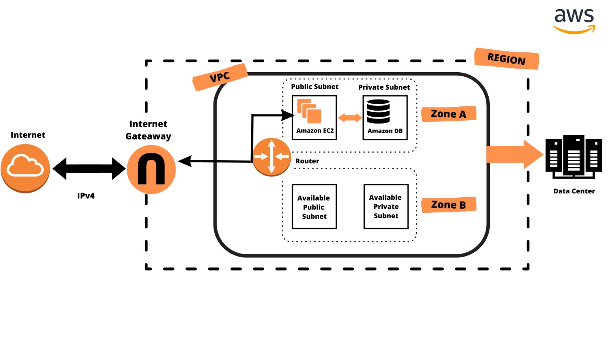
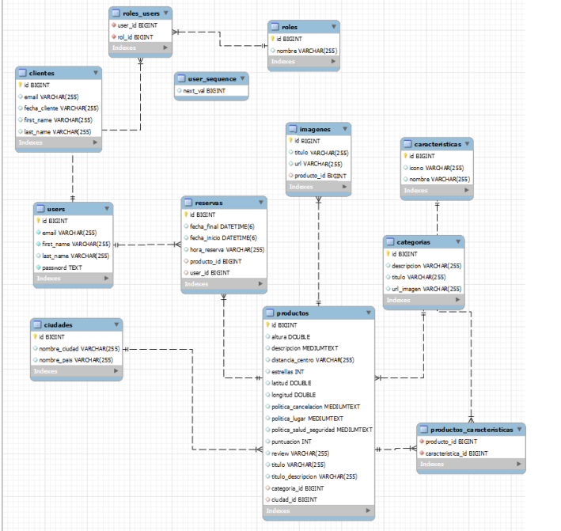

## DigitalBooking - Proyecto Integrador

**Descripción:** 
- Este proyecto se trata de la elaboración de una aplicación para ofrecer servicios de alojamiento, empleando los aprendizajes adquiridos durante la primera fase de la formación.

- La página cuenta con una opción de búsqueda para encontrar alojamientos por categoría, ciudad o fecha, lo que hace que el proceso de selección de alojamiento sea rápido y fácil.

- Además, los clientes pueden registrarse como usuarios o administradores, lo que les brinda diferentes niveles de acceso a la página, como la posibilidad de hacer reservas y generar nuevos alojamientos. Para hacer una reserva, los usuarios deben estar registrados e iniciar sesión en el sistema.En cambio, los administradores pueden crear nuevos alojamientos a través de un panel de administración, lo que permite la expansión continua de la base de datos de alojamientos.

- El proyecto fue llevado a cabo utilizando metodologías ágiles, lo que permitió al equipo trabajar de manera eficiente y cumplir con los plazos establecidos para la finalización del proyecto. Cada miembro del equipo desempeñó un papel específico, como desarrollador de backend, infraestructura, desarrollador de frontend y testing.

## Equipo

- **Celina Véliz**

- **José Zamora**

- **Matias Contreras**

- **Nicolás Condezo**

- **Tomas Rodríguez**

## Desarollo

### **Iniciando la app**

- Instalar Visual Studio Code e IntelliJ IDEA.
- Clonar el repositorio de este proyecto.

**Frontend**

1- Abrir la carpeta front-end en Visual Studio Code.

2- Una vez que nos hayamos ubicado en la ruta correspondiente, utilizaremos el siguiente comando para llevar a cabo la instalación de todas aquellas dependencias requeridas por nuestro sistema.

```
$ npm install
```

3- Ya finalizado el procedimiento previo, procederemos a ejecutar el siguiente bloque de código en la terminal.

```
$ npm run dev
```

- De esta manera,se desplegará el proyecto y deberemos seleccionar el enlace del localhost para poder ejecutarlo en el navegador.

**Backend**

 1- Abrir la carpeta back-end en IntelliJ IDEA.
 
 2- Dirigirse al archivo FullSecurityApplication.java ubicado en la carpeta src.
 
 3- Ejecutar el botón de RUN situado en la interfaz del IntelliJ.
 
**Infraestructura**

- Diagrama de arquitectura para el despliegue en amazon:



**Base de datos**

- Diagrama entidad relación en MySQL:



**Marketing**

- Video publicitario:

https://user-images.githubusercontent.com/105994663/233223335-02d6df9d-64b8-4d96-a1c2-f7f83637acd4.mp4

- Diseño de logotipo:


## Tecnologías

- **Back end**

  - Java
    - Spring Boot
    - Spring Security
    - Lombok
    - JSON Web Token
    - Log4j
  - Maven

- **Front end**

  - React
    - axios (codigo mas sencillo de API rest)
    - react-router-dom (declarar rutas y enlaces)
    - react-fontawesome (íconos)
    - react-multi-date-picker (calendario)
    - sweetalert2 (alertas)
    - swiper/react (deslizador de imagenes)
  - CSS
 
- **Base de datos**

  - MySQL
  - Amazon S3 (Simple Storage Service)
 
- **Infraestructura**

  - Amazon EC2 (Elastic Compute Cloud)
  
- **Testing**

  - Selenium
  - Postman
  - Microsoft Excel
